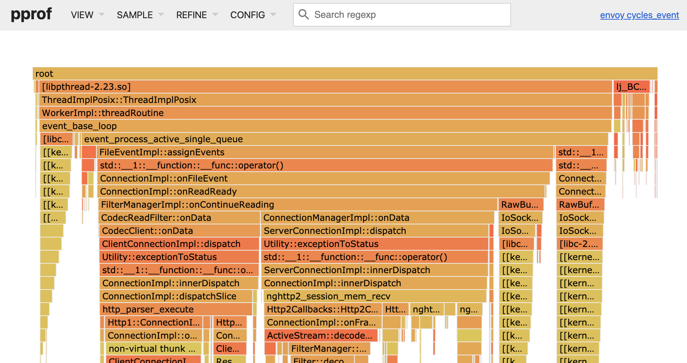

# envoy-perf-pprof

> Convenient Envoy on-CPU performance analysis with perf and pprof.

`envoy-perf-pprof` takes `perf` data collected for an Envoy process and launches [pprof](https://github.com/google/pprof/) for it.
Takes care of installing required dependencies in Docker and handling Envoy symbolization.

## Example

Call `./envoy-perf-pprof.sh v1.17.0 example/example.perf` to play with an example profile.



## Usage

### Collect `perf` data

Run `perf` on the machine running an official Envoy binary, e.g. a 10 minutes profile, as described
in [Envoy docs](https://github.com/envoyproxy/envoy/blob/main/bazel/PPROF.md#on-cpu-analysis):

```bash
$ perf record -F 49 -g -o /tmp/envoy.perf -p <envoy-pid> -- sleep 600
[ perf record: Woken up 1 times to write data ]
[ perf record: Captured and wrote 0.694 MB /tmp/envoy.perf (1532 samples) ]
```

### Analyse with `envoy-perf-pprof`

Execute `./envoy-perf-pprof.sh` with profiled Envoy version and perf data file as arguments, e.g.:

```bash
$ ./envoy-perf-pprof.sh v1.17.0 envoy.perf
(...)
Serving web UI on http://0.0.0.0:8888
```

Open the link in the browser to access [pprof](https://github.com/google/pprof/) web UI.

The first run will take a few of minutes as it builds the Docker image: installs dependencies and
downloads proper Envoy version with debug symbols retained.

## Alternatives

Instead of profiling with `perf` and `envoy-perf-pprof` you can compile Envoy with `gperftools` by yourself and use it instead of the official binaries.
This path is described in
[Envoy docs](https://github.com/envoyproxy/envoy/blob/main/bazel/PPROF.md#cpu-or-memory-consumption-testing-with-gperftools-and-pprof).
It allows you to profile both CPU and memory.

